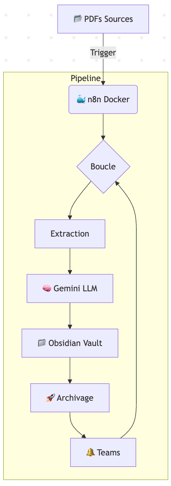

#  Automated GenAI Pipeline for Component Datasheets

##  Présentation du projet

> **Ce projet est une preuve de concept (PoC) d'automatisation de bout en bout. Il vise à transformer des documents techniques bruts (PDF) en une base de connaissances structurée et exploitable, en utilisant l'IA générative et des workflows conteneurisés.**

En 2e année de cycle d'ingénieur (Bac+4) et activement à la recherche d'une alternance en Data Science / IA pour septembre 2026 (avec un fort intérêt pour les problématiques industriels), j'ai conçu cette architecture pour démontrer mes compétences en automatisation logicielle et intégration LLM.\

**Objectifs :**
1. **Extraction :** Parcourir automatiquement des datasheets de composants électroniques.
2. **Structuration :** Exploiter un LLM pour formater l'information technique.
3. **Autonomie :** Garantir un pipeline robuste, géré de bout en bout sans intervention humaine.
___
## ⚙️ Architecture technique
Le système repose sur une approche orchestrée localement, faisant le pont entre le stockage de la machine hôte, l'intelligence distante (API) et les outils collaboratifs.\

- **Orchestrateur :** n8n (hébergé en local via Docker Compose)
- **LLM :** Google Gemini API (Prompt Engineering pour extraction de données structurées)
- **Base de connaissances :** Obsidian (fichiers Markdown)
- **Système hôte :** macOS avec gestion des volumes partagés (Docker Volumes)
- **Monitoring :** Microsoft Teams (Webhooks via Power Automate)
___
## 🔄 Flux de données (Workflow)

1. **Surveillance :** n8n scanne un dossier local contenant les datasheets PDF.
2. **Traitement séquentiel :** Une boucle itère sur chaque fichier (Batch size = 1) : chaque document est traité intégralement (extraction, structuration, écriture, archivage, notification) avant que le suivant ne démarre, évitant toute soumission simultanée à l'API.
3. **Extraction & Structuration :** Le texte brut est envoyé à Gemini avec un prompt strict demandant une sortie structurée en Markdown.
4. **Ingestion :** Le fichier généré est poussé directement dans le vault Obsidian de l'utilisateur.
5. **Nettoyage :** Un nœud d'exécution de commande bash (`mv`) déplace le PDF traité vers un dossier d'archives, garantissant l'idempotence du pipeline (pas de retraitement).
6. **Alerte :** Un webhook notifie un canal Teams de l'intégration du nouveau composant.
___
## 🛡️ Fiabilité & gestion des erreurs

Deux mécanismes ont été ajoutés pour fiabiliser le pipeline au-delà du simple happy path :

- **Anti-hallucination :** le prompt d'extraction impose des règles strictes. Aucune donnée non présente dans le texte source n'est inventée (retour explicite de "Non spécifié" le cas échéant), et toute variante de composant (plusieurs références, plusieurs boîtiers) doit être listée intégralement plutôt qu'arbitrée.
- **Gestion des quotas API :** ce traitement séquentiel introduit un espacement naturel entre deux appels à l'API Gemini (le temps de traiter intégralement l'item précédent). Insuffisant en pratique : le pipeline a malgré tout déclenché des erreurs 429 (Too Many Requests). Un nœud de temporisation (`Wait`) a été ajouté entre chaque itération pour calibrer précisément cet espacement sur les plafonds de requêtes par minute observés sur le dashboard Google AI Studio. Le pipeline respecte désormais les quotas sans erreur, de façon autonome.
___
## 🛠️ Installation & déploiement

Le code de ce dépôt inclut le fichier `compose.yaml` configuré avec les dérogations de sécurité nécessaires pour l'accès aux fichiers locaux (`N8N_RESTRICT_FILE_ACCESS_TO`) et l'exécution de commandes système (`NODES_EXCLUDE`, pour autoriser le nœud Execute Command utilisé par l'étape d'archivage), et le fichier `workflow/pipeline_datasheet.json` à importer sur votre instance n8n et à configurer avec les informations d'identification. 

Pour reproduire ce pipeline d'automatisation dans votre propre environnement n8n, la configuration nécessite quelques étapes simples.

### 1. Prérequis
* Une instance n8n opérationnelle (locale via Docker ou version Cloud).
* Une clé API Google Gemini (via Google AI Studio).
* Une URL de Webhook entrante Microsoft Teams.
* Un dossier local configuré pour le Vault Obsidian (si utilisation de Docker, vérifier le montage des volumes dans le `compose.yaml`).

### 2. Importation de l'architecture
1. Téléchargez le fichier `pipeline_datasheet.json` disponible dans le répertoire `/workflow` de ce dépôt.
2. Accédez à votre interface n8n.
3. Créez un nouveau workflow (Add Workflow).
4. Ouvrez le menu des options (icône en haut à droite) et sélectionnez **Import from File**.
5. Chargez le fichier `pipeline_datasheet.json`. L'ensemble du circuit d'orchestration s'affichera sur le canevas.

### 3. Configuration des variables d'environnement et identifiants
Avant de lancer l'exécution, les chemins et identifiants doivent être mis à jour avec vos propres paramètres.

* **Module LLM (Google Gemini)**
  Créez un nouveau "Credential" de type Google Gemini API et renseignez votre clé secrète.
* **Module d'Alerte (Webhook Teams)**
  Dans les paramètres du nœud HTTP Request, remplacez l'URL cible par celle générée par votre canal Teams. Maintenez l'authentification sur `None`.
* **Modules de Stockage (Lecture/Écriture)**
  Ajustez les chemins d'accès pour qu'ils correspondent à la structure de votre machine hôte ou de vos volumes Docker (dossier source des PDF et dossier de destination Obsidian).

### 4. Lancement
Déclenchez le processus via le bouton **Execute Workflow**. Le monitoring via Teams confirmera la bonne exécution de la chaîne de traitement\
**Note sur les scripts personnalisés :** Le code JavaScript utilisé pour la transformation des données est nativement intégré dans le fichier JSON du workflow. Pour faciliter la relecture par les développeurs, ces scripts ont également été isolés et sont consultables en clair dans le répertoire `/scr`
